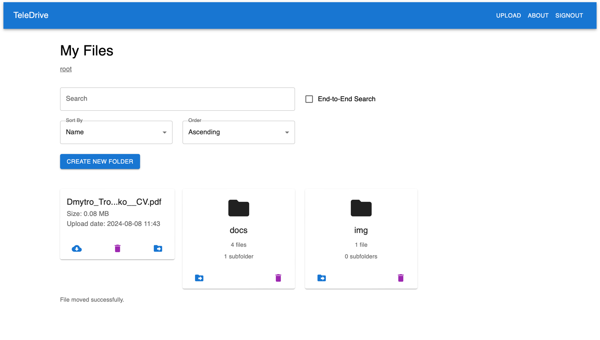

# TeleDrive - GoogleDrive Fork
**Live Service:** [Telegram Bot](https://t.me/teledriveqbot)

## Overview

This is a file storage service that allows users to manage their files with various functionalities. The service supports file comparison, deletion, sorting, sharing, and manipulation. It is implemented using modern technologies and is built to handle files without limits.

### Key Features
- **File Management**: Upload, delete, and manipulate files.
- **Folder Navigation**: Browse and manage folders.
- **File Operations**: Compare, sort, and share files.
- **No Limits**: Unlimited file storage and manipulation.
- **Telegram API Integration**: Leverage Telegram's API for file storage.





## Technologies Used

- **Frontend**: React
- **Backend**: Flask
- **Database**: PostgreSQL
- **Bot Framework**: Aiogram
- **Containerization**: Docker, Docker Compose
- **Web Server**: NGINX
- **Hosting**: VPS

## Getting Started
### Installation

1. **Clone the repository:**

    ```bash
    git clone https://github.com/dmtryii/teledrive.git
    cd your-repository
    ```
   
2. **Set up environment variables:**

    Create a `.env` file in the `./backend` directory and add your environment variables. For example:

    ```env
    FLASK_APP=app.py
    FLASK_ENV=development
    FLASK_DEBUG=true
    
    SECRET_KEY=YOUR_SECRET_KEY
    JWT_SECRET_KEY=YOUR_JWT_SECRET_KEY

    BOT_TOKEN=YOUR_BOT_TOKEN
    
    POSTGRES_USER=YOUR_POSTGRES_USER
    POSTGRES_PASSWORD=YOUR_POSTGRES_PASSWORD
    POSTGRES_DB=YOUR_POSTGRES_DB
    ```
   
    Create a `.env` file in the `./bot` directory and add your environment variables. For example:

    ```env
    AUTH_FORM_URL=YOUR_FRONTEND_URL:3000/signin
   
    AUTH_API_URL=YOUR_BACKEND_URL:5001/api/auth
    USER_API_URL=YOUR_BACKEND_URL:5001/api/users
   
    BOT_WEBHOOK_PORT=5002
    BOT_WEBHOOK_URL=YOUR_BOT_WEBHOOK_URL
    BOT_WEBHOOK_PATH=/webhook
   
    BOT_TOKEN=YOUR_BOT_TOKEN
    ```

3. **In `./frontend/app/src/config/axiosConfig.js`, change the link to the link of your api:**
   ```javascript
   const axiosInstance = axios.create({
       baseURL: 'YOUR_BACKEND_URL:5001/api',
   });
    ```

4. **Build and run the Docker containers:**

    ```bash
    docker-compose up --build
    ```
   
5. **Services are running:** You can switch to the bot and work

## Acknowledgments

- Thanks to [Telegram API](https://core.telegram.org/bots/api) for providing the API used in this project.
- Special thanks to the open-source community for the tools and libraries used.